# Credit Line Management System (CLMS)

**Author:** Shrey Sharma — 22BCE3520, VIT
**Project:** UPI Credit Line Management System
**Version:** 2.0.0

---

## Table of Contents

1. [Project Overview](#project-overview)
2. [System Architecture](#system-architecture)
3. [Backend — CLMS-UPI](#backend--clms-upi)
   - [Tech Stack](#backend-tech-stack)
   - [Project Structure](#backend-project-structure)
   - [Database Schema](#database-schema)
   - [API Endpoints](#api-endpoints)
   - [Security Layers](#security-layers)
   - [Redis Shadow Ledger](#redis-shadow-ledger)
   - [Risk Engine](#risk-engine)
   - [MCC Rules](#mcc-rules)
   - [Mock NPCI Switch](#mock-npci-switch)
4. [Mobile App — CLMSApp](#mobile-app--clmsapp)
   - [Tech Stack](#app-tech-stack)
   - [Project Structure](#app-project-structure)
   - [Screens & Features](#screens--features)
   - [Navigation Flow](#navigation-flow)
   - [QR Scanner](#qr-scanner)
5. [Transaction Lifecycle](#transaction-lifecycle)
6. [Setup & Running](#setup--running)
7. [Environment Variables](#environment-variables)
8. [Screenshots](#screenshots)

---

## Project Overview

CLMS is a full-stack simulation of a **UPI-based Credit Line Management System**, modelled on how real-world systems like CRED, LazyPay, and Slice operate on the UPI credit rail. It consists of:

- A **Node.js/Express REST API** backend with PostgreSQL persistence and Redis for a real-time shadow ledger
- A **React Native Android app** that lets users register, log in, make payments, repay, scan UPI QR codes, and view transaction history

The system simulates:
- Purpose-bound credit (different loan types can only be spent at approved merchant categories)
- Sub-millisecond credit limit checks using a Redis shadow ledger
- Mock NPCI switch for testing transaction scenarios
- Razorpay test-mode integration for QR code generation

---

## System Architecture

```
┌─────────────────────────────────────────────────────────────┐
│                    Android App (CLMSApp)                     │
│   React Native 0.75 · React Navigation · Camera Kit         │
└────────────────────────┬────────────────────────────────────┘
                         │ HTTP (via ADB reverse / USB)
                         ▼
┌─────────────────────────────────────────────────────────────┐
│              CLMS Backend — Node.js / Express 5             │
│                                                             │
│  ┌──────────┐ ┌──────────┐ ┌──────────┐ ┌──────────────┐  │
│  │   Auth   │ │   UPI    │ │ Txn Svc  │ │  Risk Engine │  │
│  │ Service  │ │ Service  │ │          │ │  (MCC Rules) │  │
│  └──────────┘ └──────────┘ └──────────┘ └──────────────┘  │
│                                                             │
│  ┌──────────────────────┐  ┌───────────────────────────┐   │
│  │  JWT Middleware      │  │  Rate Limiter (express-    │   │
│  │  NPCI Sig Verifier   │  │  rate-limit)               │   │
│  └──────────────────────┘  └───────────────────────────┘   │
└───────────────┬──────────────────┬──────────────────────────┘
                │                  │
       ┌────────▼──────┐   ┌───────▼──────┐
       │  PostgreSQL   │   │    Redis     │
       │  (clms_db)    │   │ Shadow Ledger│
       │  Port 5432    │   │  Port 6379   │
       └───────────────┘   └──────────────┘
```

---

## Backend — CLMS-UPI

### Backend Tech Stack

| Package | Version | Purpose |
|---------|---------|---------|
| `express` | ^5.2.1 | HTTP server and routing |
| `pg` | ^8.20.0 | PostgreSQL client (node-postgres) |
| `redis` | ^5.12.1 | Redis client for shadow ledger |
| `jsonwebtoken` | ^9.0.3 | JWT authentication |
| `razorpay` | ^2.9.6 | QR code generation (test mode) |
| `qrcode` | ^1.5.4 | Base64 QR image generation |
| `helmet` | ^8.1.0 | HTTP security headers |
| `cors` | ^2.8.6 | Cross-origin resource sharing |
| `express-rate-limit` | ^8.3.2 | API rate limiting |
| `dotenv` | ^17.4.2 | Environment variable management |
| `bcrypt` | ^6.0.0 | Password/PIN hashing (available) |
| `uuid` | ^14.0.0 | UUID generation |
| `nodemon` | ^3.1.14 | Dev auto-restart |

### Backend Project Structure

```
clms-upi/
├── src/
│   ├── server.js                    # Express app entry point
│   ├── database/
│   │   ├── db.js                    # PostgreSQL connection pool
│   │   ├── redis.js                 # Redis client (shadow ledger)
│   │   └── schema.sql               # Full DB schema + seed data
│   ├── middleware/
│   │   ├── auth.js                  # JWT verify + NPCI signature
│   │   └── rateLimiter.js           # API / auth / txn rate limits
│   └── services/
│       ├── user/
│       │   ├── authService.js       # Login + public registration
│       │   └── userService.js       # User CRUD (protected)
│       ├── account/
│       │   └── accountService.js    # Credit account + shadow ledger sync
│       ├── transaction/
│       │   └── transactionService.js # Pay, repay, statement
│       ├── upi/
│       │   └── upiService.js        # QR generation, UPI pay/repay flows
│       ├── risk/
│       │   └── riskService.js       # MCC-based risk engine
│       └── mock-npci/
│           └── npciSwitch.js        # Simulated NPCI switch scenarios
├── .env                             # Secrets (not committed)
└── package.json
```

### Database Schema

The system uses five PostgreSQL tables:

#### `users`
```sql
CREATE TABLE users (
    id        UUID PRIMARY KEY DEFAULT gen_random_uuid(),
    name      VARCHAR(100) NOT NULL,
    mobile    VARCHAR(15) UNIQUE NOT NULL,
    upi_id    VARCHAR(50) UNIQUE NOT NULL,
    created_at TIMESTAMP DEFAULT NOW()
);
```

#### `credit_accounts`
```sql
CREATE TABLE credit_accounts (
    id              UUID PRIMARY KEY DEFAULT gen_random_uuid(),
    user_id         UUID REFERENCES users(id),
    loan_type       VARCHAR(50) NOT NULL,   -- EDUCATION_LOAN | CONSUMER_LOAN | AGRI_LOAN
    total_limit     NUMERIC(12,2) NOT NULL,
    available_limit NUMERIC(12,2) NOT NULL,
    status          VARCHAR(20) DEFAULT 'ACTIVE',
    upi_pin_hash    VARCHAR(255),           -- PIN stored for mock auth
    created_at      TIMESTAMP DEFAULT NOW()
);
```

#### `transactions`
```sql
CREATE TABLE transactions (
    id               UUID PRIMARY KEY DEFAULT gen_random_uuid(),
    account_id       UUID REFERENCES credit_accounts(id),
    amount           NUMERIC(12,2) NOT NULL,
    merchant_name    VARCHAR(100),
    mcc              VARCHAR(10),
    purpose_code     VARCHAR(50),
    status           VARCHAR(20),           -- SUCCESS | REJECTED | FAILED
    rejection_reason TEXT,
    created_at       TIMESTAMP DEFAULT NOW()
);
```

#### `mcc_rules`
```sql
CREATE TABLE mcc_rules (
    id          UUID PRIMARY KEY DEFAULT gen_random_uuid(),
    loan_type   VARCHAR(50) NOT NULL,
    mcc         VARCHAR(10) NOT NULL,
    is_allowed  BOOLEAN NOT NULL,
    description VARCHAR(100)
);
```

#### `consent_log`
Audit trail for all consent events.

---

### API Endpoints

#### Public Routes (no auth)

| Method | Endpoint | Description |
|--------|----------|-------------|
| `POST` | `/api/auth/login` | Authenticate with mobile + UPI ID, returns JWT |
| `POST` | `/api/auth/register` | Register new user + create credit account |
| `GET`  | `/api/auth/verify` | Verify JWT validity |

**Login request:**
```json
{
  "mobile": "9876543210",
  "upi_id": "shrey@upi"
}
```

**Register request:**
```json
{
  "name": "Shrey Sharma",
  "mobile": "9876543210",
  "upi_id": "shrey@upi",
  "loan_type": "EDUCATION_LOAN",
  "upi_pin": "123456"
}
```

#### Protected Routes (Bearer JWT required)

| Method | Endpoint | Description |
|--------|----------|-------------|
| `GET`  | `/api/account/:id` | Get account details |
| `GET`  | `/api/account/by-user/:user_id` | Get account by user ID |
| `POST` | `/api/transaction/pay` | Make a payment |
| `POST` | `/api/transaction/repay` | Repay credit |
| `GET`  | `/api/transaction/:account_id/statement` | Last 10 transactions |
| `POST` | `/api/upi/generate-qr` | Generate Razorpay UPI QR |
| `GET`  | `/api/upi/discover/:mobile` | Discover credit lines |
| `POST` | `/api/risk/evaluate` | Test risk engine directly |
| `GET`  | `/api/risk/mcc-rules` | View all MCC rules |

**Payment request:**
```json
{
  "account_id": "uuid",
  "upi_pin": "123456",
  "amount": 500,
  "merchant_name": "Delhi University",
  "mcc": "8220"
}
```

**Payment response:**
```json
{
  "success": true,
  "decision": "APPROVED",
  "transaction_id": "uuid",
  "remaining_limit": 24500,
  "performance": {
    "total_latency_ms": 12,
    "limit_check_source": "⚡ Redis (sub-ms)"
  }
}
```

---

### Security Layers

#### 1. JWT Authentication (`middleware/auth.js`)

```javascript
const verifyToken = (req, res, next) => {
    const token = req.headers['authorization']?.split(' ')[1];
    if (!token) return res.status(401).json({ error: 'ACCESS DENIED' });
    try {
        req.user = jwt.verify(token, process.env.JWT_SECRET);
        next();
    } catch {
        res.status(403).json({ error: 'INVALID TOKEN' });
    }
};
```

Tokens expire in **24 hours** and carry `user_id`, `mobile`, `upi_id`, and `name`.

#### 2. Rate Limiting (`middleware/rateLimiter.js`)

| Limiter | Window | Max Requests | Applied To |
|---------|--------|-------------|------------|
| `apiLimiter` | 15 min | 100 | All routes |
| `authLimiter` | 15 min | 10 | Login only (brute-force protection) |
| `transactionLimiter` | 1 min | 20 | All transaction routes |

#### 3. Mock NPCI Signature Verification

```javascript
const verifyNPCISignature = (req, res, next) => {
    const npciKey = req.headers['x-npci-api-key'];
    const timestamp = req.headers['x-timestamp'];
    // Rejects requests older than 5 minutes (replay attack prevention)
    if (currentTime - parseInt(timestamp) > 5 * 60 * 1000) {
        return res.status(401).json({ error: 'REQUEST EXPIRED' });
    }
    if (npciKey !== process.env.NPCI_API_KEY) {
        return res.status(403).json({ error: 'INVALID NPCI KEY' });
    }
    next();
};
```

#### 4. Helmet Security Headers

`helmet()` is applied globally, setting:
- `X-Content-Type-Options: nosniff`
- `X-Frame-Options: DENY`
- `Strict-Transport-Security`
- Content Security Policy headers

---

### Redis Shadow Ledger

The shadow ledger is the most performance-critical component. Each credit account is cached in Redis as a hash:

```
Key:   account:<account_id>
Fields: available_limit, total_limit, status, loan_type, upi_pin_hash
```

**Write-through strategy:** Redis is updated first (sub-millisecond), then PostgreSQL is updated asynchronously. If the PostgreSQL write fails, Redis is rolled back.

```javascript
// Debit Redis first (instant response)
const newLimit = account.available_limit - amount;
await redisClient.hSet(`account:${account_id}`, {
    available_limit: newLimit.toString()
});

// Then persist to PostgreSQL (durability)
await pool.query(
    `UPDATE credit_accounts SET available_limit = available_limit - $1 WHERE id = $2`,
    [amount, account_id]
);
```

**Performance result:** Limit checks that hit Redis respond in **< 5ms** vs ~20–50ms for direct PostgreSQL queries.

---

### Risk Engine

The risk engine (`services/risk/riskService.js`) runs three checks on every transaction:

```javascript
const evaluateRisk = async (loan_type, mcc, amount, account) => {
    // Check 1: Account must be ACTIVE
    if (account.status !== 'ACTIVE') { ... }

    // Check 2: Sufficient available limit
    if (amount > parseFloat(account.available_limit)) { ... }

    // Check 3: MCC allowed for this loan type
    const mccResult = await pool.query(
        `SELECT is_allowed, description FROM mcc_rules
         WHERE loan_type = $1 AND mcc = $2`,
        [loan_type, mcc]
    );
    // MCC not in rules = blocked (deny-by-default policy)
    if (mccResult.rows.length === 0) { approved = false; }
};
```

### MCC Rules

Merchant Category Codes define where each loan type can be spent (purpose-bound credit):

| Loan Type | MCC | Category | Allowed |
|-----------|-----|----------|---------|
| EDUCATION_LOAN | 8220 | Colleges & Universities | ✅ |
| EDUCATION_LOAN | 8211 | Schools | ✅ |
| EDUCATION_LOAN | 5812 | Restaurants | ❌ |
| EDUCATION_LOAN | 7995 | Gambling | ❌ |
| CONSUMER_LOAN | 5732 | Electronics Stores | ✅ |
| CONSUMER_LOAN | 5411 | Grocery Stores | ✅ |
| CONSUMER_LOAN | 7995 | Gambling | ❌ |
| CONSUMER_LOAN | 6011 | Cash Withdrawal | ❌ |
| AGRI_LOAN | 5261 | Farm Supply Stores | ✅ |
| AGRI_LOAN | 0763 | Agricultural Co-ops | ✅ |
| AGRI_LOAN | 5812 | Restaurants | ❌ |
| AGRI_LOAN | 5732 | Electronics | ❌ |

### Mock NPCI Switch

`/api/mock-npci` simulates the National Payments Corporation of India switch. It includes pre-built test scenarios:

| Scenario | MCC | Expected Result |
|----------|-----|----------------|
| Delhi University (Education) | 8220 | ✅ Approved |
| DPS School | 8211 | ✅ Approved |
| Pizza Hut (Restaurant) | 5812 | ❌ Rejected — blocked MCC |
| Casino Royale | 7995 | ❌ Rejected — gambling blocked |
| ₹9,99,999 transaction | 8220 | ❌ Rejected — insufficient limit |

Requests to `/api/mock-npci` require both `x-npci-api-key` and `x-timestamp` headers, and timestamps older than 5 minutes are rejected to prevent replay attacks.

---

## Mobile App — CLMSApp

### App Tech Stack

| Package | Version | Purpose |
|---------|---------|---------|
| `react-native` | 0.75.3 | Core mobile framework |
| `@react-navigation/native` | ^6.1.18 | Navigation container |
| `@react-navigation/native-stack` | ^6.11.0 | Stack-based screen navigation |
| `react-native-screens` | ^3.35.0 | Native screen optimization |
| `react-native-safe-area-context` | ^4.11.0 | Safe area handling |
| `react-native-camera-kit` | ^17.0.1 | QR code scanning (ML Kit) |
| TypeScript | 5.0.4 | Type safety (App.tsx) |

**Target platform:** Android (minSdkVersion 24, targetSdkVersion 34)
**Dev environment:** Metro bundler + ADB USB reverse tunnelling

### App Project Structure

```
CLMSApp/
├── App.tsx                          # Root: NavigationContainer + Stack
├── src/
│   ├── config/
│   │   └── api.js                   # All API endpoint URLs
│   ├── screens/
│   │   ├── LoginScreen.js           # Mobile + UPI ID login
│   │   ├── RegisterScreen.js        # New user registration
│   │   ├── DashboardScreen.js       # Credit summary + action tiles
│   │   ├── PayScreen.js             # UPI credit payment
│   │   ├── RepaymentScreen.js       # Credit repayment
│   │   ├── StatementScreen.js       # Last 10 transactions
│   │   ├── GenerateQRScreen.js      # Merchant QR generation
│   │   └── QRScannerScreen.js       # Camera-based QR scanner
│   └── utils/
│       └── qrStore.js               # Module-level QR scan result store
└── android/
    ├── build.gradle                 # minSdk 24, compileSdk 34
    └── app/
        ├── build.gradle             # App config, namespace com.clmsapp
        └── src/main/
            └── AndroidManifest.xml  # INTERNET + CAMERA permissions
```

### Screens & Features

#### Login Screen

Authenticates the user against the backend using mobile number and UPI ID. On success, immediately fetches the linked `account_id` via `GET /api/account/by-user/:user_id` and passes it downstream to all screens.

```javascript
const res = await fetch(API.login, {
    method: 'POST',
    headers: {'Content-Type': 'application/json'},
    body: JSON.stringify({mobile, upi_id: upiId}),
});
// After login, fetch account_id
const accRes = await fetch(API.accountByUser(data.user.id), {
    headers: {Authorization: `Bearer ${data.token}`},
});
navigation.replace('Dashboard', {token: data.token, user});
```

---

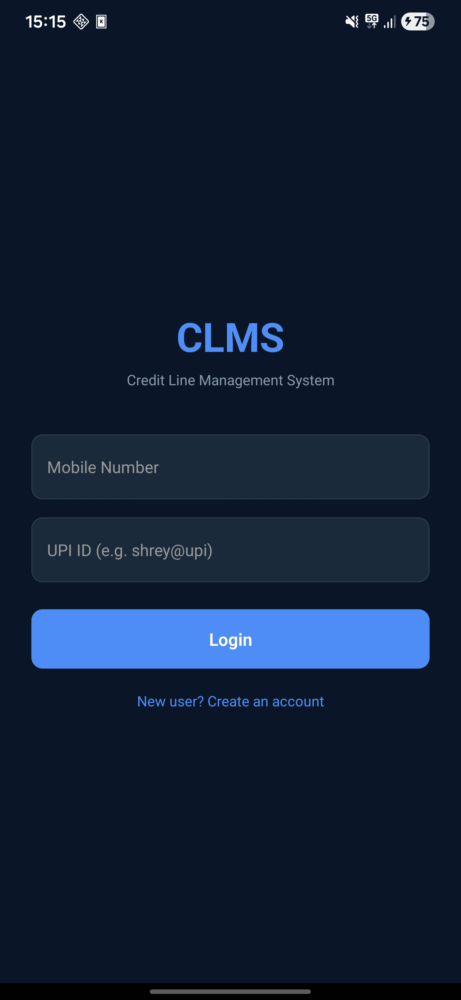

---

#### Register Screen

New user registration form. Collects full name, mobile, UPI ID, UPI PIN (4–6 digits), and loan type. Calls `POST /api/auth/register` which atomically creates a user row and a credit account (₹25,000 default limit) in a single PostgreSQL transaction.

```javascript
body: JSON.stringify({
    name, mobile,
    upi_id: upiId,
    loan_type: loanType,   // EDUCATION_LOAN | CONSUMER_LOAN | AGRI_LOAN
    upi_pin: upiPin
})
```

---


---

#### Dashboard Screen

Displays a real-time credit summary card and four action tiles. Credit utilisation is computed client-side from `total_limit` and `available_limit`.

```javascript
const used = parseFloat(account.total_limit) - parseFloat(account.available_limit);
const pct  = total > 0 ? (used / total) * 100 : 0;
```

Action tiles navigate to: Pay, Repayment, Statement, Generate QR.

---


---

#### Pay Screen

Allows the user to make a UPI credit payment. Includes:
- Manual entry of merchant name, amount, MCC category, and UPI PIN
- **"Scan QR Code" button** — opens the camera scanner to auto-fill fields from a UPI QR

```javascript
const handlePay = async () => {
    const res = await fetch(API.pay, {
        method: 'POST',
        headers: {Authorization: `Bearer ${token}`},
        body: JSON.stringify({account_id, upi_pin, amount, merchant_name, mcc}),
    });
};
```

---


---

#### QR Scanner Screen

Full-screen camera using `react-native-camera-kit`. Requests `CAMERA` permission at runtime via `PermissionsAndroid`. Scans QR codes containing UPI deep-links and parses the fields:

```javascript
// UPI link format: upi://pay?pa=...&pn=MerchantName&am=100&mcc=8220
const params = {};
const url = new URL(raw);
url.searchParams.forEach((v, k) => { params[k] = v; });

setScannedQR({
    merchantName: params.pn || '',
    amount:       params.am || '',
    mcc:          params.mcc || '5912',
});
navigation.goBack(); // Returns to PayScreen, which reads via useFocusEffect
```

**Key implementation detail:** The native `showFrame` prop is intentionally **not used** because it restricts scanning to barcodes entirely within the frame rectangle. A decorative frame overlay is drawn using a plain `View` instead.

---


---

#### Generate QR Screen

Used by a merchant to generate a payment QR. Calls `POST /api/upi/generate-qr` which creates a Razorpay test-mode order and returns a base64-encoded QR image containing the UPI deep-link.

```javascript
body: JSON.stringify({merchant_name: merchantName, amount: amt, mcc})
// Response: { qr_code: "data:image/png;base64,...", order: {...}, upi_link: "upi://..." }
```

Displays the QR image, order ID, merchant name, amount, and status.

---


---

#### Repayment Screen

Shows the outstanding balance (`total_limit - available_limit`) and lets the user repay any amount up to the outstanding. Includes a "Pay Full Outstanding" quick-fill button.

```javascript
const outstanding = (total - available).toFixed(2);
// POST /api/transaction/repay with {account_id, amount}
```

---


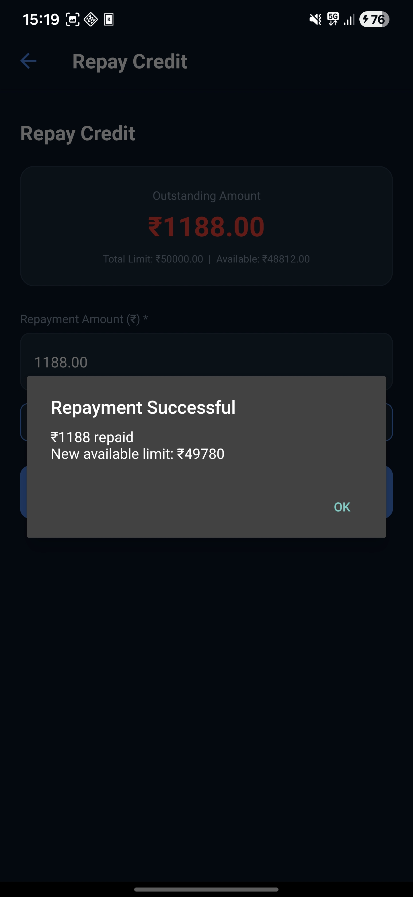

---

#### Statement Screen

Fetches and displays the last 10 transactions via `GET /api/transaction/:account_id/statement`. Each item shows merchant name, date/time, amount (green for repayments, white for debits), and status badge (green/red/amber).

```javascript
const fetchStatement = async () => {
    const res = await fetch(API.statement(user.account_id), {
        headers: {Authorization: `Bearer ${token}`},
    });
    const data = await res.json();
    setTransactions(data.data || []);
};
```

---


---

### Navigation Flow

```
Login ──────────────────────────────────► Dashboard
  │                                          │
  ▼                                    ┌─────┼──────┐────────────┐
Register                              Pay  Repay  Statement  GenerateQR
                                       │
                                       ▼
                                   QRScanner
                                  (goBack + qrStore)
                                       │
                                       └──► Pay (useFocusEffect reads data)
```

Navigation uses `@react-navigation/native-stack`. Token, user object, and account data are passed as route params between screens. QR scan results are passed back from `QRScannerScreen` via a module-level store (`qrStore.js`) rather than navigation params, to avoid React Navigation's non-serializable params warning.

---

### QR Scanner

The scanner is implemented with `react-native-camera-kit` (v17), which uses **Google ML Kit** under the hood for barcode detection on Android. Key configuration:

```jsx
<Camera
    style={StyleSheet.absoluteFill}
    scanBarcode          // Enable barcode scanning mode
    onReadCode={handleScan}
    allowedBarcodeTypes={['qr']}
    focusMode="on"       // Keep auto-focus active
    // showFrame is intentionally omitted — it restricts scan area to frame bounds
/>
```

Runtime camera permission is requested via:
```javascript
await PermissionsAndroid.request(
    PermissionsAndroid.PERMISSIONS.CAMERA,
    { title: 'Camera Permission', ... }
);
```

---

## Transaction Lifecycle

A complete payment flow from app tap to database write:

```
1. User taps "Pay" in app
        │
2. App sends POST /api/transaction/pay
   {account_id, upi_pin, amount, merchant_name, mcc}
        │
3. Backend reads Redis Shadow Ledger          ← sub-millisecond
   account:{account_id} → available_limit, status, loan_type
        │
4. UPI PIN validated against PostgreSQL       ← always DB, never Redis
        │
5. Risk Engine evaluates:
   ├─ Account status === 'ACTIVE'?
   ├─ amount <= available_limit?
   └─ MCC allowed for loan_type? (mcc_rules table)
        │
6a. REJECTED → INSERT transaction(status='REJECTED') → 422 response
        │
6b. APPROVED:
   ├─ Debit Redis: available_limit -= amount   ← instant
   ├─ BEGIN PostgreSQL transaction
   │    UPDATE credit_accounts SET available_limit -= amount
   │    INSERT transactions(status='SUCCESS')
   │  COMMIT
   └─ If PG fails → ROLLBACK Redis too
        │
7. Response returned with transaction_id,
   remaining_limit, latency_ms, limit_check_source
```

---

## Setup & Running

### Prerequisites

- Node.js ≥ 18
- PostgreSQL 14+
- Redis 7+
- Android SDK (for app)
- ADB (Android Debug Bridge)

### Backend

```bash
# Clone and install
cd clms-upi
npm install

# Set up database
psql -U postgres -c "CREATE DATABASE clms_db;"
psql -U postgres -d clms_db -f src/database/schema.sql

# Configure environment
cp .env.example .env   # fill in DB password, Razorpay keys, etc.

# Start server
npm start               # node src/server.js
# or for development:
npm run dev             # nodemon src/server.js
```

### Mobile App

```bash
# Install dependencies
cd CLMSApp
npm install

# Connect Android device via USB, enable USB debugging
adb reverse tcp:8081 tcp:8081   # Metro bundler
adb reverse tcp:3000 tcp:3000   # Backend API

# Start Metro bundler (separate terminal)
npx react-native start

# Build and install
npx react-native run-android
```

> **Note:** `adb reverse` must be re-run after every USB reconnect.

---

## Environment Variables

```env
PORT=3000

# PostgreSQL
DB_HOST=localhost
DB_PORT=5432
DB_NAME=clms_db
DB_USER=postgres
DB_PASSWORD=your_password

# Redis
REDIS_HOST=localhost
REDIS_PORT=6379

# Auth
JWT_SECRET=your_jwt_secret

# Razorpay (test mode)
RAZORPAY_KEY_ID=rzp_test_...
RAZORPAY_KEY_SECRET=...

# Mock NPCI
NPCI_API_KEY=npci_mock_key
ADMIN_SECRET=admin_secret
```

---

## Screenshots


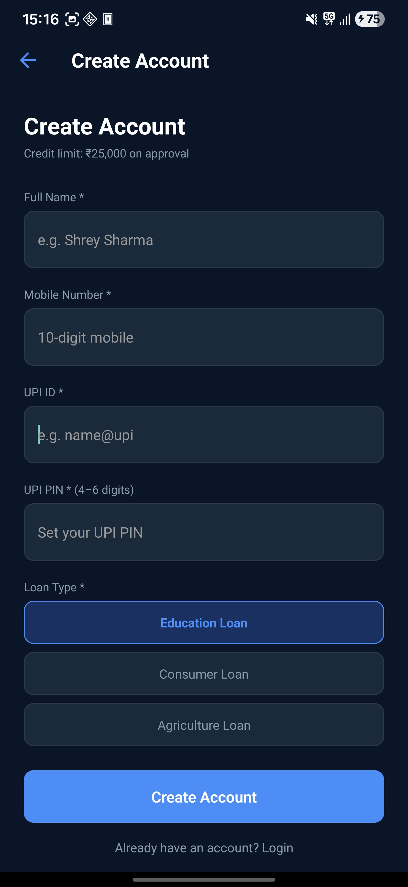

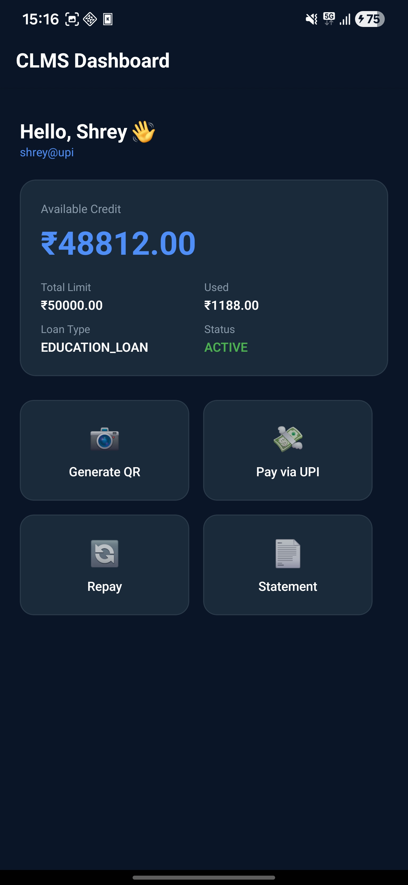

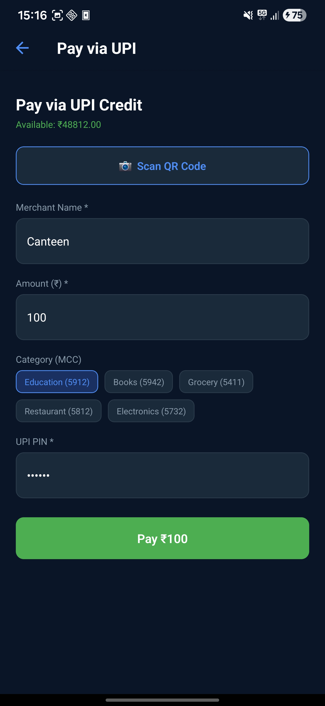

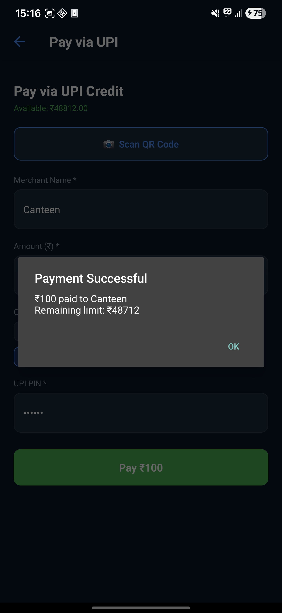

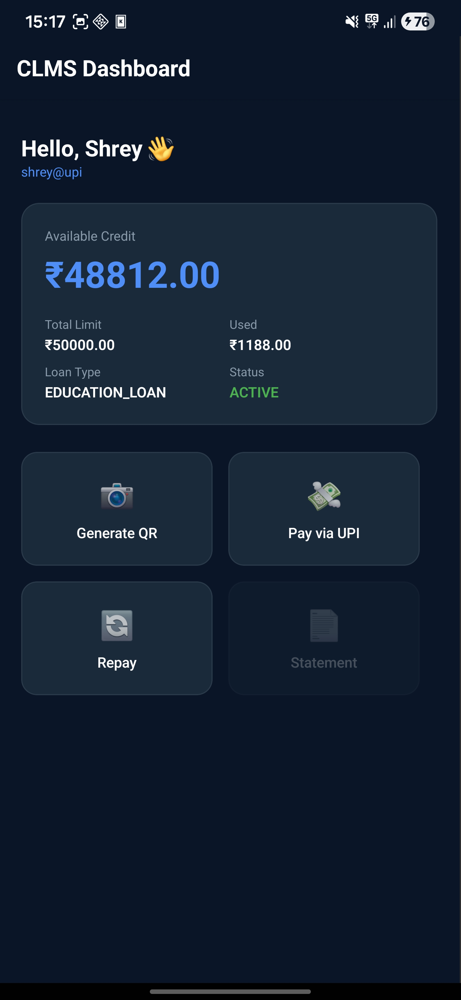

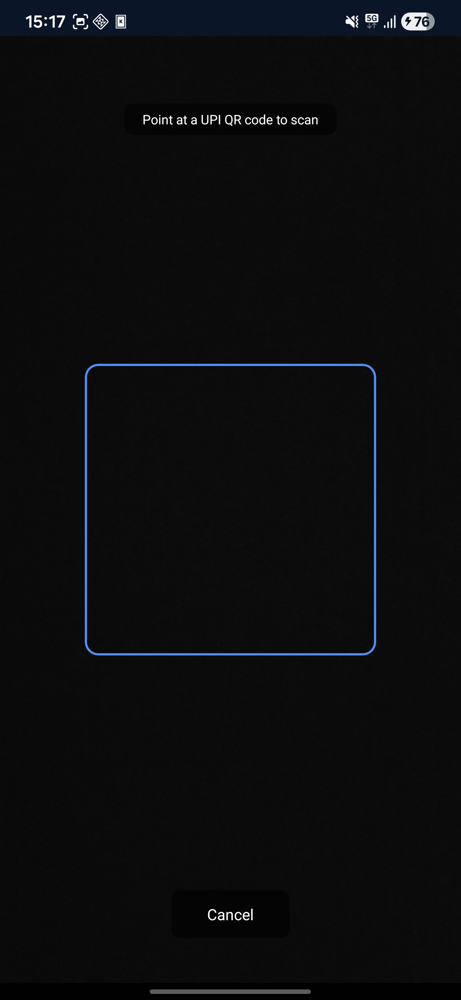


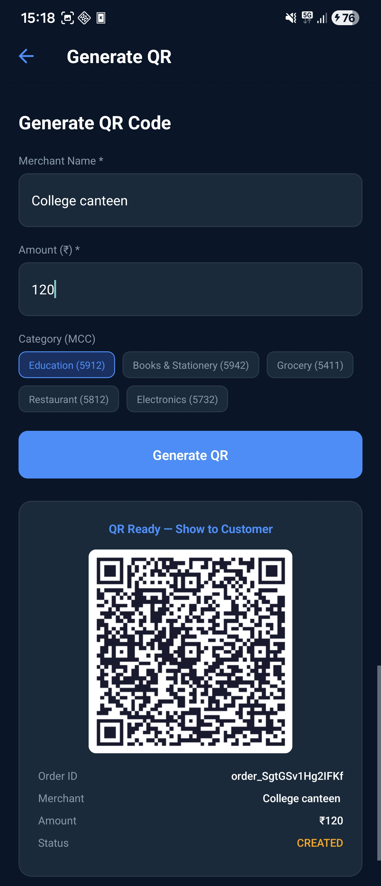

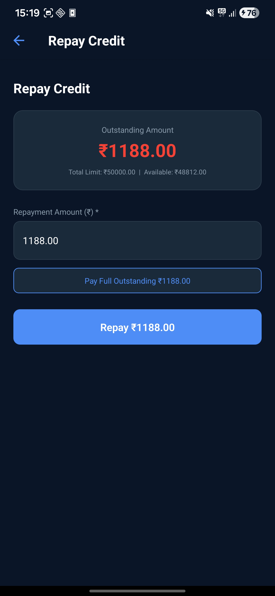


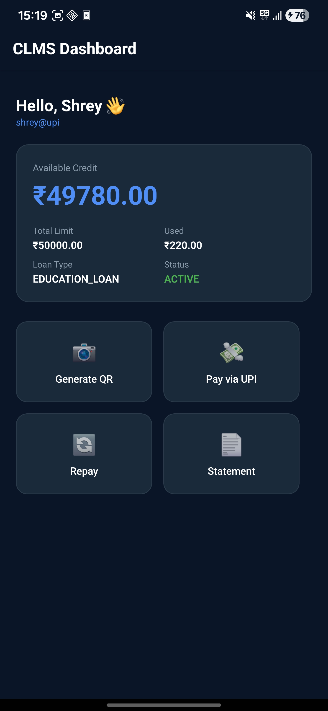

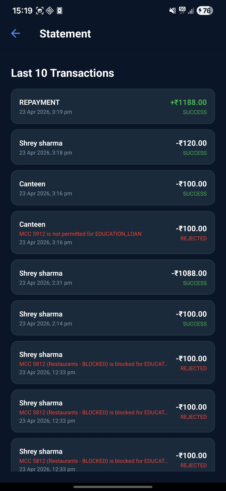

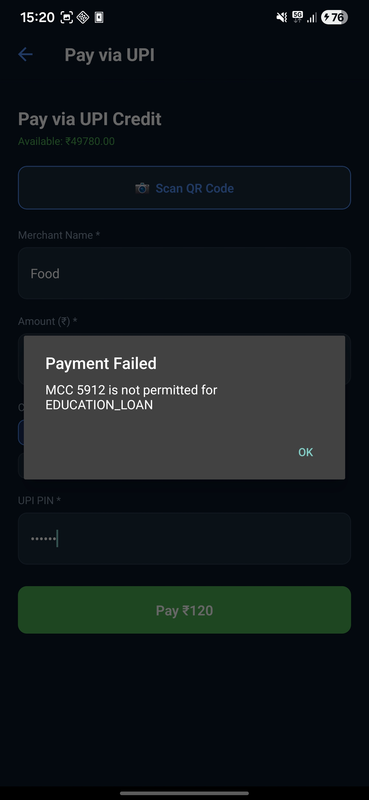

